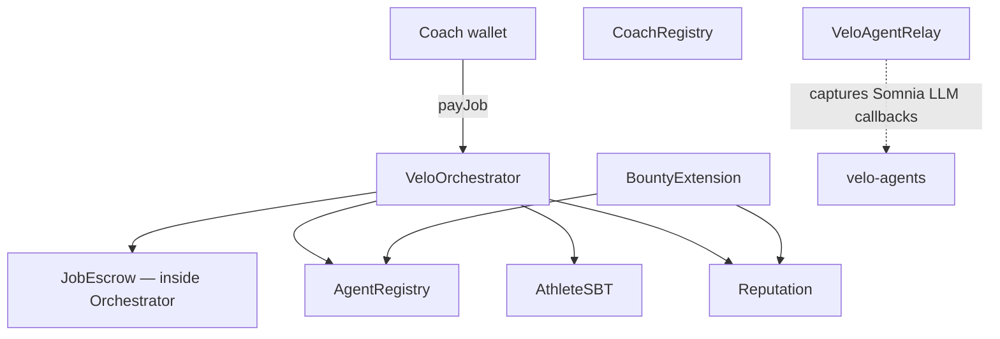
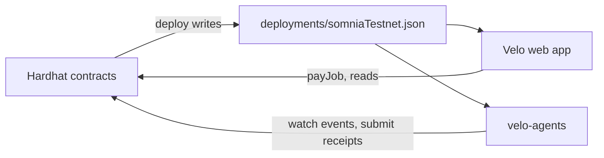

# Hardhat — Smart Contracts

On-chain infrastructure for Velo on Somnia (chain ID 50312). These contracts define job lifecycle, payment escrow, receipt verification, athlete history, agent identity, reputation, and the open bounty marketplace.

---

## What this folder contains

| Area | Location | Purpose |
|------|----------|---------|
| **Contracts** | `contracts/` | All deployed Solidity — orchestrator, registries, SBT, bounties, relay |
| **Interfaces** | `contracts/interfaces/` | Public ABIs consumed by other contracts |
| **Abstract bases** | `contracts/abstract/` | Shared behaviour — escrow, receipt storage, registry checks, soulbound logic |
| **Libraries** | `contracts/libraries/` | Receipt hashing and job ID derivation |
| **Mocks** | `contracts/mocks/` | Test doubles for local runs |
| **Tests** | `test/` | Full lifecycle and edge-case coverage on Hardhat's simulated network |
| **Config** | `hardhat.config.ts` | Networks, compiler settings, account loading |

Deploy and utility scripts live under `scripts/` (invoked via npm scripts below).

---

## Contracts at a glance

| Contract | Role |
|----------|------|
| **VeloOrchestrator** | Central entry point — coaches pay for jobs, agents submit receipts, escrow settles |
| **AthleteSBT** | Non-transferable token per athlete; session receipts append to a permanent history |
| **AgentRegistry** | Public directory of agent wallets, skills, fees, and endpoints |
| **CoachRegistry** | On-chain list of coach wallets for role separation |
| **Reputation** | Scorebook updated after completed jobs; writable only by trusted Velo contracts |
| **BountyExtension** | Open marketplace — post tasks, bid, accept, settle on-chain |
| **VeloAgentRelay** | Receives Somnia native LLM inference callbacks so the agent runner can read results |

---

## How a session works

1. Coach calls `payJob` — fee locks in escrow, `JobRequested` event fires.
2. Form agent submits a signed EIP-712 form receipt — `FormReceiptSubmitted` event fires.
3. Prescriber agent submits a signed prescription receipt chained to the form receipt.
4. Orchestrator verifies signatures against the AgentRegistry, releases escrow (agents withdraw via pull payment), and appends the session to the athlete's SBT.

Receipts are signed off-chain; only the submit transactions touch the chain.

---

## Networks

| Name | Chain ID | Use |
|------|----------|-----|
| `hardhat` | 31337 | Local tests — built-in simulated network |
| `localhost` | 31337 | Attach to a running `hardhat node` |
| `somniaTestnet` | 50312 | Live testnet deploys |

Somnia testnet RPC: `https://dream-rpc.somnia.network`

---

## Common commands

| Command | What it does |
|---------|--------------|
| `npm run compile` | Compile all contracts |
| `npm run test` | Run the test suite locally |
| `npm run deploy:somnia` | Deploy to Somnia testnet and write `deployments/somniaTestnet.json` |
| `npm run register:somnia` | Register Form and Prescriber agent wallets in AgentRegistry |

Copy `.env.example` to `.env` and set deployer and agent private keys before deploying. Never commit `.env`.

After deploy, run `register:somnia` so the Orchestrator accepts receipts from your agent wallets.

---

## Design choices

| Decision | Why |
|----------|-----|
| **Pull payment** | Agents call `withdraw()` — avoids reentrancy and gas estimation on the Orchestrator |
| **EIP-712 receipts** | Agents sign typed messages off-chain; only submission is an on-chain transaction |
| **Soulbound history** | Athletes own their record; coaches cannot alter or delete it |
| **Composable agents** | Form and prescription are separate receipt types with explicit chaining via `priorReceiptHash` |

---

## How this connects to the rest of Velo

Contracts are the source of truth for job state, payments, and receipt validity. The web app sends transactions and reads state; the agent runner reacts to events and submits signed results. Neither layer can bypass on-chain verification.
