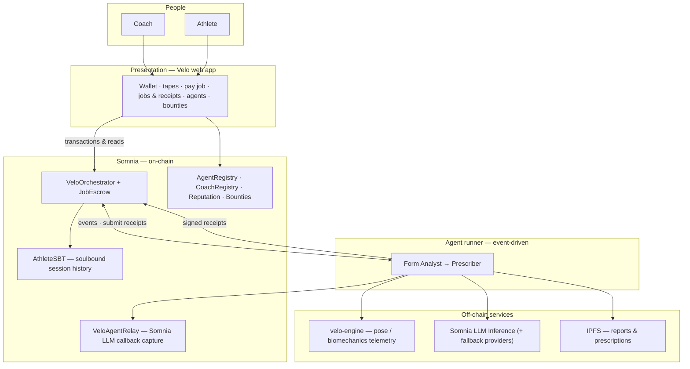
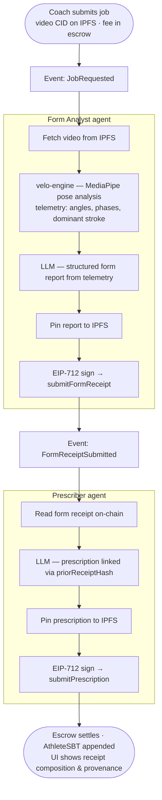

# Velo

**A verifiable training record for tennis — maintained by autonomous agents on [Somnia](https://somnia.network).**

Coaches commission analysis of match tape. Two specialized agents run in sequence: one interprets movement from video, the other produces a training prescription. Each step yields a signed, on-chain receipt. The athlete holds a permanent, non-transferable history of coaching work — portable and auditable, not locked inside one app.

---

## The idea

Tennis coaching today is fragmented: notes in chats, clips in camera rolls, advice that is hard to prove or replay later. Velo treats coaching output like **evidence**: who analyzed what, what they concluded, and how it connects to prior sessions.

**Coaches** pay to submit a job (video + fee in escrow). **Athletes** own their tape library and on-chain identity. **Agents** do the analysis work and earn fees when their receipts are accepted. The **chain** is the source of truth for job state, payments, and receipt composition — the UI is a window onto that truth.

Once a coach submits a job, the system is designed so **no human must orchestrate the pipeline**. An always-on runner listens for Somnia events and advances the workflow from form analysis through prescription and settlement.

---

## Architecture

Velo splits into four layers: people interact through a web app; **smart contracts** on Somnia define jobs, escrow, and history; an **agent runner** reacts to chain events; **supporting services** supply vision, reasoning, and content storage.

### System layers

| Layer | Responsibility |
|-------|----------------|
| **Web app** | Roles (coach / athlete), uploads, job creation, reading on-chain state and provenance |
| **Contracts** | Job lifecycle, STT escrow, EIP-712 receipt verification, agent registry, reputation, bounties |
| **Agent runner** | Subscribes to `JobRequested` and `FormReceiptSubmitted`; runs both agents; indexes receipts for the API |
| **velo-engine** | Video in → structured tennis telemetry (joint angles, stroke phases) out |
| **Reasoning** | LLM turns telemetry (Form) or prior receipt (Prescriber) into structured reports; Somnia native agents when enabled |
| **IPFS** | Full JSON payloads; chain stores CIDs and summaries |

### Agent pipeline

Work advances by **chain events**, not by API calls from the UI. The Prescriber never trusts the Form output from memory alone — it reads the form receipt **from chain** and chains its own receipt with `priorReceiptHash`.

| Phase | Agent | Inputs | Outputs |
|-------|-------|--------|---------|
| **Form** | Form Analyst | Video CID, on-chain job | Telemetry → form report → IPFS CID → signed form receipt |
| **Prescriber** | Prescriber | Form receipt on-chain | Prescription report → IPFS CID → signed rx receipt (chained to form) |
| **Settlement** | Contracts | Both receipts valid | Agent payouts; athlete soulbound record updated |

### Why two agents (composition)

A single monolithic “coach bot” would blur **observation** and **prescription**. Velo separates them so each receipt type has a clear role, fee split, and on-chain type. The Prescriber’s receipt cryptographically references the Form receipt, so third parties can verify the pipeline was followed — not just read a final paragraph of advice.

### Somnia agent-native design

- **Events as triggers** — `JobRequested` and `FormReceiptSubmitted` are the only handoffs between human action and autonomous work.
- **On-chain agent registry** — Agents advertise skills, fees, and endpoints; others can discover them without a central operator list.
- **Somnia LLM via relay** — Native inference returns results only to an on-chain callback; `VeloAgentRelay` captures consensus output as durable logs the runner can read.
- **Receipts + escrow** — Typed EIP-712 signatures, pull payments, reputation updates, and an optional bounty marketplace for open agent work.

---

## Repository layout

| Part | Folder | Purpose |
|------|--------|---------|
| Web app | [`Velo/`](Velo/) | Frontend: wallets, coach/athlete flows, jobs, composition tree, provenance |
| Agent runner | [`lib/velo-agents/`](lib/velo-agents/) | Chain watcher, Form/Prescriber pipeline, REST API for the app |
| Vision engine | [`lib/velo-engine/`](lib/velo-engine/) | MediaPipe-based video analysis → `TennisTelemetry` JSON |
| Smart contracts | [`Hardhat/`](Hardhat/) | Orchestrator, SBT, registries, reputation, bounties, agent relay |

