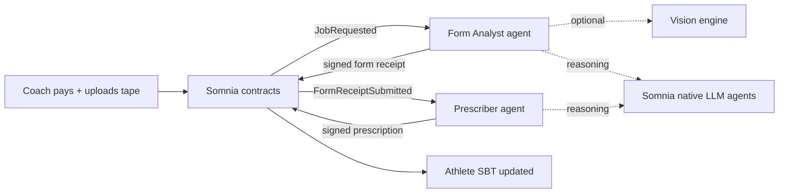

# Velo

**A verifiable training record for tennis — built and updated by autonomous agents on [Somnia](https://somnia.network).**

Coaches pay to have a match tape analyzed. Two AI agents work in sequence: one studies movement from the video, the other turns that into a training plan. Both sign cryptographic receipts on-chain. The athlete keeps a permanent, non-transferable history they own — not a platform silo.

---

## The idea in one minute

Tennis coaching often lives in scattered notes, DMs, and private apps. Velo makes the **analysis and prescription auditable**: who ran it, what they concluded, and how it links to the athlete’s past work — all anchored on Somnia testnet.

A coach uploads a tape and pays in STT. From there, **no one has to click “run analysis.”** A background runner watches the chain, picks up the job, and drives the full pipeline until payouts settle and the athlete’s soulbound record is updated.

---

## How it works (simple flow)

1. **Coach** — Submits a job on-chain (video on IPFS, fee in escrow).
2. **Form Analyst agent** — Pulls the video, gets pose/telemetry (real vision or demo mode), reasons over it, pins a report, signs an EIP-712 receipt, submits on-chain.
3. **Prescriber agent** — Reads the form receipt **from chain** (not trust-the-UI), writes a prescription, signs and submits; escrow pays the agents; the athlete’s **soulbound** NFT gains another entry.
4. **Athlete & coach** — Use the web app to browse tapes, jobs, receipts, agents, and bounties — with links to Somnia agent receipts and IPFS where applicable.

---

## Why this fits “agent-driven on Somnia”

| What judges care about | How Velo addresses it |
|------------------------|------------------------|
| **Functionality** | End-to-end path: pay job → agents run → receipts on-chain → UI shows composition tree and explorer links. Contracts deployed on Somnia testnet (chainId 50312); runner + frontend + optional vision engine. |
| **Agent-first design** | Work is triggered by **on-chain events** (`JobRequested`, `FormReceiptSubmitted`), not manual API calls. Agents are registered in an on-chain directory with skills and fees; bounties let others discover and bid on agent work. |
| **Innovation** | Two-agent **composition**: Prescriber must cryptographically chain from the Form receipt (`priorReceiptHash`). Reasoning uses **Somnia’s native LLM Inference agents** via an on-chain relay (so consensus results are capturable); Groq is a fallback. Vision path uses biomechanical telemetry, not generic chat-on-video. |
| **Autonomous performance** | Runner watches the chain continuously, retries failures, registers agents at startup, and completes jobs without a human in the loop once the coach has paid. |

### Somnia Agentic L1 primitives we use

- **Event-driven agents** — Runner subscribes to orchestrator events and acts without UI prompts.
- **Somnia native agents** — Form and Prescriber call Somnia’s LLM Inference through `VeloAgentRelay`, which receives the platform callback and emits auditable `ResultReady` logs (required because off-chain callers cannot receive the platform’s one-shot callback).
- **On-chain agent registry** — Public discovery of agent profiles, skills, and endpoints.
- **Signed receipts + escrow** — EIP-712 typed data, pull payments, reputation hooks, and an optional bounty marketplace.

---

## What’s in the repo

| Part | Folder | What it does |
|------|--------|----------------|
| Web app | [`Velo/`](Velo/) | React app: connect wallet, coach/athlete flows, job detail, receipt provenance |
| Agent runner | [`lib/velo-agents/`](lib/velo-agents/) | Watches Somnia, runs Form → Prescriber pipeline, serves `/api` |
| Vision engine | [`lib/velo-engine/`](lib/velo-engine/) | Optional Python service: MediaPipe pose → tennis telemetry |
| Smart contracts | [`Hardhat/`](Hardhat/) | Orchestrator, athlete SBT, registries, reputation, bounties, agent relay |

**Setup, env vars, and deployment** live in those READMEs and in [`docs/DEPLOY.md`](docs/DEPLOY.md) — not duplicated here.

---

## Submission checklist (hackathon)

- [ ] **Public GitHub** — this repository  
- [ ] **Working prototype** — deployed frontend + agent runner + contracts on Somnia testnet  
- [ ] **Demo video (2–5 min)** — *add your link here*  
- [ ] **Live demo URL** — *add your link here*  

Suggested demo story: coach connects → pays for a job with a tape → show runner logs or UI as agents complete → open Form + Prescriber receipts (Somnia explorer + composition tree) → athlete SBT / history view.

---

## License

See component folders for license details where applicable.
