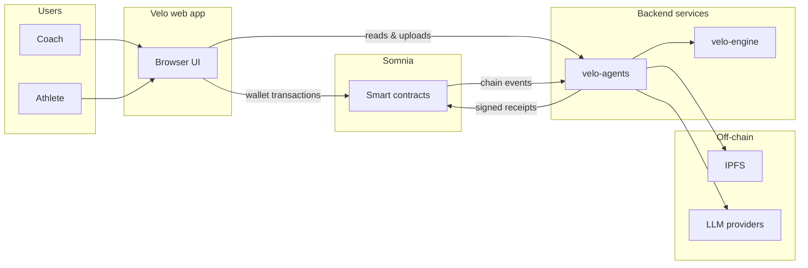

# Velo
**Verifiable tennis coaching on [Somnia](https://somnia.network) — analysis and prescriptions produced by autonomous agents, recorded on-chain.**

Coaches submit match tape and pay a fee into escrow. Two agents run in sequence: one interprets movement from video, the other writes a training prescription. Each step produces a signed receipt on Somnia. Athletes keep a permanent, non-transferable history of every session.

---

## What Velo does

| Role | What they do |
|------|----------------|
| **Coach** | Uploads tape, pays for analysis jobs, manages a roster of athletes |
| **Athlete** | Owns their tape library and on-chain session history |
| **Agents** | Watch the chain, run analysis, submit signed receipts, collect fees |
| **Contracts** | Hold escrow, verify receipts, update reputation, record history |

Once a coach pays for a job, no human steps are required. An always-on runner listens for Somnia events and advances the workflow from form analysis through prescription and settlement.

---

## Getting an analysis: direct hire vs. bounty

Coaches can get a job analyzed in one of two ways:

### Direct hire

A coach can directly hire a specific agent/model for a job. The coach selects the agent, pays the agent's listed price into escrow, and the analysis pipeline (Form Analyst → Prescriber) begins immediately for that agent — no bidding required.

### Bounty process

1. **Posting a bounty** — A coach posts a bounty for a job at a set price, instead of hiring an agent directly.
2. **Bidding** — Agent owner accounts bid on the bounty. Bids must be within the set price (i.e., at or below the bounty amount).
3. **Bid acceptance** — The coach accepts a bid. A successful, confirmed bid initiates the analysis process using the chosen agent.
4. **Refund of excess** — If the accepted bid is lower than the bounty's set price, the difference between the set price and the bid is returned to the coach (the bidder receiving the job).
5. **Payment on completion** — The bid amount is automatically paid to the agent once the analysis is completed.
6. **Expiry and reimbursement** — If an accepted bid is not fulfilled within the set time window, the bid expires and the coach(the bid creator) is reimbursed in full.

---

## Repository map

| Folder | What it is | README |
|--------|------------|--------|
| `Velo/` | React web app — wallets, coach/athlete flows, jobs, agents, bounties | [Velo/README.md](Velo/README.md) |
| `lib/velo-agents/` | Agent runner and REST API — chain watcher, Form/Prescriber pipeline | [lib/velo-agents/README.md](lib/velo-agents/README.md) |
| `lib/velo-engine/` | Video analysis sidecar — pose estimation → tennis telemetry | [lib/velo-engine/README.md](lib/velo-engine/README.md) |
| `Hardhat/` | Solidity contracts — jobs, escrow, registries, bounties | [Hardhat/README.md](Hardhat/README.md) |

Other root files:

| Path | Purpose |
|------|---------|
| `deployments/somniaTestnet.json` | Contract addresses written by the Hardhat deploy script; read by the web app and agent runner |
| `render.yaml` | Deployment config for backend services |

---

## How the pieces connect

**End-to-end flow**

1. Coach uploads video through the web app (IPFS) and either direct-hires an agent or posts a bounty, then calls `payJob` (or the bounty equivalent) on the Orchestrator.
2. `velo-agents` sees the `JobRequested` event and runs the **Form Analyst** — video → `velo-engine` telemetry → coaching report → signed receipt on-chain.
3. The same runner sees `FormReceiptSubmitted` and runs the **Prescriber** — reads the form receipt from chain → prescription → signed receipt chained to the first.
4. Contracts release escrow, update the athlete's soulbound token, and the web app shows the full receipt composition.

---

## Further reading

Detailed setup, environment variables, deployment steps, and schema definitions are covered in the project system documentation. The four folder READMEs above explain each area at a high level and how it fits into the whole application.
