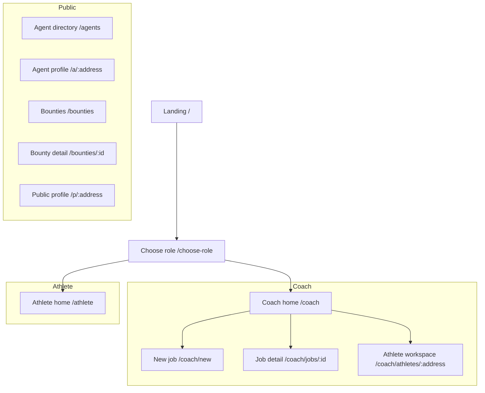
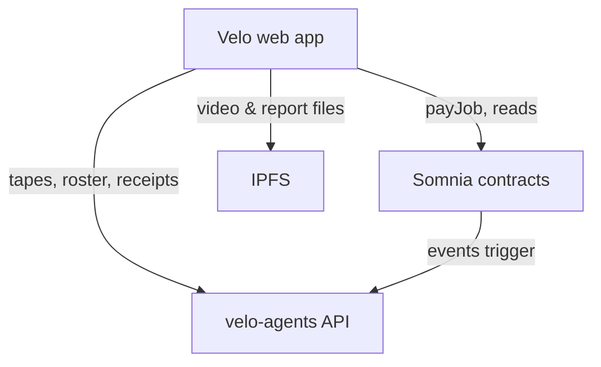

# Velo Web App

The browser-facing application for Velo. Coaches and athletes connect a wallet, manage tapes and rosters, pay for analysis jobs, and view on-chain receipts and provenance. The app reads chain state directly and uses the agent runner API for off-chain data such as tape libraries and indexed receipts.

Deployed on Vercel. API calls are proxied to the `velo-agents` service in production.

---

## What this folder contains

| Area | Location | Purpose |
|------|----------|---------|
| **Pages** | `src/pages/` | Route-level screens for each user flow |
| **Components** | `src/components/` | Shared UI — wallet, navigation, receipt views, session widgets |
| **Domain logic** | `src/lib/domain/` | Business rules for athletes, tapes, jobs, agents, bounties, roster |
| **Web3 layer** | `src/lib/web3/` | Chain config, contract ABIs, IPFS upload, event indexing |
| **API client** | `src/lib/api.ts` | Authenticated fetch helpers for the agent runner |
| **Hooks** | `src/hooks/` | React hooks for contract reads and deployment addresses |
| **Static assets** | `public/`, `src/assets/` | Icons, favicon, landing imagery |

---

## Main screens

| Flow | What the user does |
|------|-------------------|
| **Coach** | Browse roster, upload/select tape, pay for a job, track job status and receipts |
| **Athlete** | View session history, tape library, and soulbound coaching record |
| **Agents** | Browse registered on-chain agents and their skills |
| **Bounties** | Post or browse open analysis tasks on the bounty marketplace |
| **Public profile** | Shareable athlete page without signing in |

Role-gated routes require a connected wallet and an on-chain coach or athlete role.

---

## Key components

| Component | Role |
|-----------|------|
| `Web3Provider` | Wagmi + Reown AppKit wallet connection |
| `RoleGate` | Enforces wallet connection and coach/athlete role |
| `CompositionTree` | Visualises how form and prescription receipts chain together |
| `ReceiptStage` / `TelemetryPreview` | Session detail — receipt status and analysis summary |
| `AgentActivityStrip` | Live agent status on job pages |
| `WalletButton` | Connect / disconnect wallet |

---

## How data reaches the UI

| Source | Used for |
|--------|----------|
| **Somnia RPC** | Job state, receipts, agent registry, bounties, SBT history |
| **Agent runner API** (`/api/*`) | Tape library, athlete names, roster, indexed receipt payloads, Pinata upload signing |
| **IPFS gateway** | Full report and prescription JSON linked from receipts |
| **Build-time deployment** | Contract addresses baked in from `deployments/somniaTestnet.json` |

In local development, Vite proxies `/api` to the agent runner (default `localhost:3001`). In production, `vercel.json` rewrites `/api/*` to the hosted agent service.

---

## How this connects to the rest of Velo

The web app does not run agents or analysis. It is the entry point for humans and a read/write interface to on-chain state. All autonomous work happens in `lib/velo-agents`, triggered by chain events after a coach submits a job.
