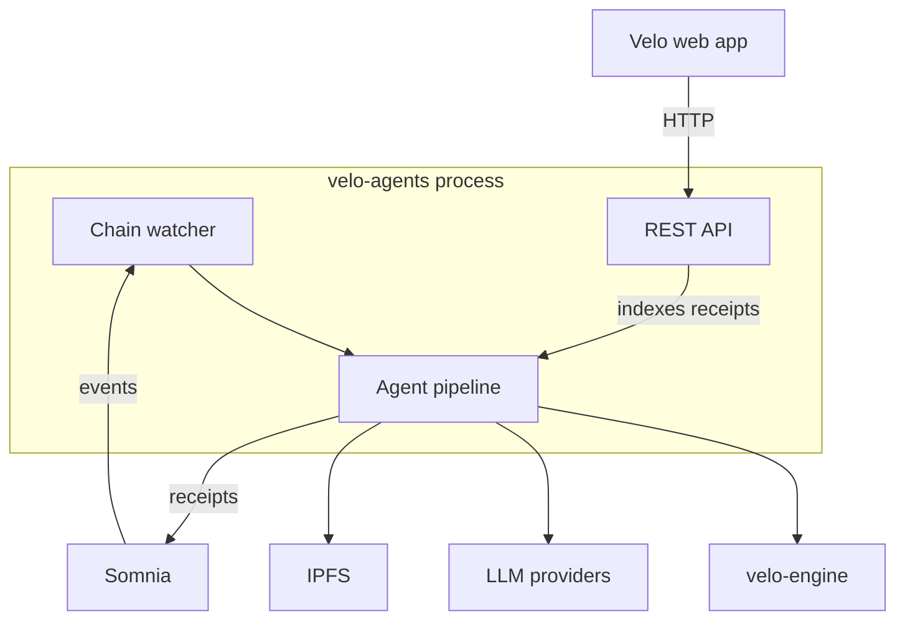
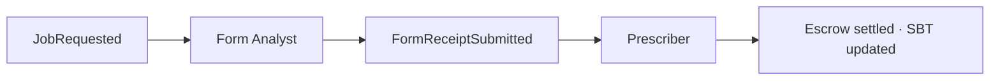
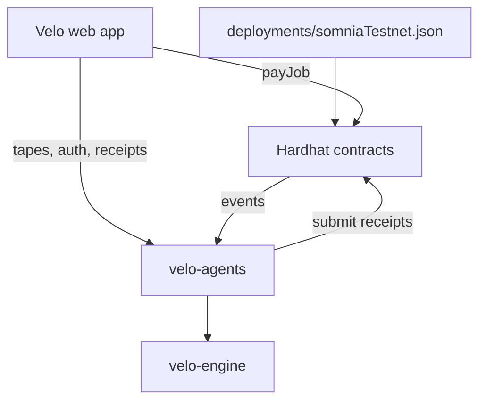

# velo-agents

The autonomous backend for Velo. A single Node.js process that watches Somnia for new work, runs the coaching agent pipeline, and serves the REST API the web app calls.

---

## What this folder contains

| Area | Location | Purpose |
|------|----------|---------|
| **Entry point** | `src/index.ts` | Starts API server, registers agents on-chain, attaches chain watcher |
| **Agents** | `src/agents/` | Form Analyst, Prescriber, and Bounty handlers |
| **Chain** | `src/chain/` | Event watcher, contract clients, EIP-712 signing |
| **API** | `src/api/` | Express server, route handlers, receipt/tape/roster store |
| **AI** | `src/ai/` | LLM dispatch — Somnia native path with Groq fallback, prompts, schemas |
| **IPFS** | `src/ipfs/` | Pinata upload and gateway URL resolution |
| **Utils** | `src/utils/` | Config, logging, retry, startup precheck |

---

## Three responsibilities

| Responsibility | What happens |
|----------------|--------------|
| **Chain watcher** | Subscribes to `JobRequested`, `FormReceiptSubmitted`, and bounty events via WebSocket or polling |
| **Agent pipeline** | Runs Form → Prescriber in sequence (plus Bounty agent for marketplace tasks) |
| **REST API** | Serves health, auth, tapes, roster, receipts, bounties, and Pinata upload signing |

---

## Agent pipeline

Work advances by **chain events**, not by calls from the UI.

| Agent | Trigger | Inputs | Output |
|-------|---------|--------|--------|
| **Form Analyst** | `JobRequested` | Video CID from job | Telemetry → form report → IPFS → signed form receipt |
| **Prescriber** | `FormReceiptSubmitted` | Form receipt read from chain | Prescription report → IPFS → signed rx receipt (chained to form) |
| **Bounty** | Bounty accepted on-chain | Bounty video CID | Analysis report → bounty settlement |

The Prescriber always reads the form receipt from chain — it never trusts in-memory state alone.

---

## AI reasoning

The runner supports two paths and switches automatically.

| Path | When used | Result |
|------|-----------|--------|
| **Somnia native** | `SOMNIA_AGENTS_ENABLED` and a valid LLM agent ID are set | Consensus-verified inference with an on-chain receipt via VeloAgentRelay |
| **Groq fallback** | Native path times out, is unconfigured, or returns no runners | Standard off-chain LLM call |

The UI shows which path produced each receipt.

---

## REST API overview

Routes are grouped by concern. Full request/response detail is in the system documentation.

| Group | Routes | Purpose |
|-------|--------|---------|
| **Health** | `/api/healthz` | Liveness and chain connection status |
| **Auth** | `/api/auth/*` | Sign-In With Ethereum — nonce and session JWT |
| **Uploads** | `/api/pinata/*` | Presigned IPFS upload tokens |
| **Receipts** | `/api/receipts/:jobId` | Indexed form and prescription payloads for the UI |
| **Tapes** | `/api/tapes/*` | Athlete video library |
| **Athletes** | `/api/athletes/*` | Display names |
| **Roster** | `/api/roster/*`, `/api/me/*` | Coach–athlete invites and membership |
| **Bounties** | `/api/bounties/:id` | Indexed bounty reports |

Write operations require a valid SIWE session scoped to the signing wallet.

---

## Off-chain storage

Receipts, tape metadata, athlete names, and roster links are stored off-chain. By default this is in-memory (lost on restart). Set `SUPABASE_URL` and `SUPABASE_SERVICE_KEY` to persist in Supabase. The runner falls back to memory if Supabase is unavailable.

---

## Configuration essentials

All variables are listed in `.env.example`. The critical ones:

| Variable | Purpose |
|----------|---------|
| Contract addresses | From `deployments/somniaTestnet.json` |
| `AGENT_FORM_PRIVATE_KEY` / `AGENT_PRESCRIBER_PRIVATE_KEY` | Wallets that submit on-chain receipts |
| `GROQ_API_KEY` | Required unless native Somnia path is fully configured |
| `VISION_ENGINE_URL` | URL of the live `velo-engine` service the Form Analyst calls for pose analysis |
| `API_SECRET` | Signs session JWTs — use a strong random value in production |

Health check path for deployment platforms: `/api/healthz`

---

## How this connects to the rest of Velo

This service is the bridge between human actions in the browser and autonomous execution on Somnia. Contracts define the rules; this process enforces them by watching events, doing the analysis work, and returning cryptographically signed results.
