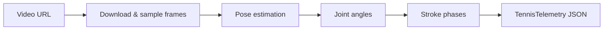
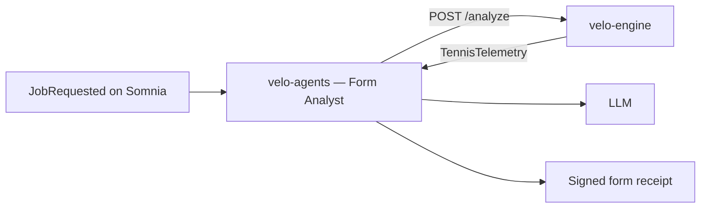

# velo-engine

Video analysis sidecar for Velo. Receives a tennis video URL, runs pose estimation frame by frame, and returns structured biomechanical telemetry that the Form Analyst agent turns into a coaching report.

In production, the Form Analyst calls this service on every job before generating its coaching report.

---

## What this folder contains

| Area | Location | Purpose |
|------|----------|---------|
| **HTTP server** | `src/main.py` | FastAPI app — `/analyze` and `/healthz` endpoints |
| **Analysis pipeline** | `src/analyze.py` | Video download, frame sampling, orchestration |
| **Backends** | `src/analyzer_mediapipe.py`, `src/analyzer_custom.py` | Pluggable pose estimation implementations |
| **Base class** | `src/analyzer_base.py` | Shared interface all backends implement |
| **Factory** | `src/factory.py` | Selects backend from `ANALYZER_BACKEND` env var |
| **Data models** | `src/models.py` | Request and `TennisTelemetry` response shapes |
| **Custom models** | `custom_models/` | Drop zone for your own model weights |

---

## What it produces

For each video, the engine:

1. Downloads from an IPFS gateway or direct URL
2. Samples every Nth frame (configurable)
3. Locates body landmarks via the active backend
4. Calculates five joint angles — shoulder, elbow, wrist, hip, knee
5. Classifies stroke phases — preparation, contact, follow-through
6. Determines dominant stroke type and stroke count
7. Computes a symmetry score (0 = inconsistent, 1 = very consistent)

The response is a single `TennisTelemetry` JSON object consumed by the Form Analyst in `velo-agents`.

---

## Analysis backends

| Backend | Env value | Notes |
|---------|-----------|-------|
| **MediaPipe** | `mediapipe` (default) | Google's open-source pose model — no extra weights required |
| **Custom** | `custom` | Load your own model from `custom_models/` — implement the two methods in `analyzer_custom.py` |

Switching backends requires only an environment variable change and a redeploy. Downstream logic (symmetry, stroke counting, phase classification) is backend-agnostic.

---

## Endpoints

| Endpoint | Method | Purpose |
|----------|--------|---------|
| `/analyze` | POST | Accepts a video URL, returns `TennisTelemetry` |
| `/healthz` | GET | Liveness check for Docker and the agent runner startup precheck |

Configurable options (port, max duration, model complexity, sample rate) are in `.env.example`.

---

## Deployment

Ships with a `Dockerfile` that reads the platform-injected `PORT` variable. Works on Render, Koyeb, and similar hosts without changes. Defined alongside `velo-agents` in the root `render.yaml`.

For production on modest hardware, the defaults balance speed and accuracy. Increase `MAX_VIDEO_DURATION_S` or `MEDIAPIPE_MODEL_COMPLEXITY` when you have more compute available.

---

## How this connects to the rest of Velo

The engine has no awareness of wallets, receipts, or the chain. It is a pure analysis function called by the Form Analyst during step one of the pipeline. The agent runner reaches it via `VISION_ENGINE_URL`.
